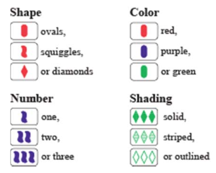
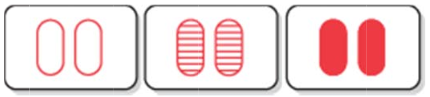
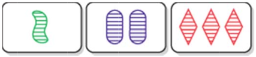
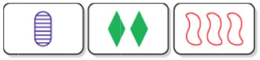

Set Game
=========================
Set game is a dynamic Game!
This has programmed with Scala in order to show the difference between the languages. ()

##Types

##Rules
A SET consists of 3 cards in which each of the cards features, looked at one-by-one, are the same on each card, or, are different on each card. 
All of the features must separately satisfy this rule.
In other words: shape must be either the same in all 3 cards, or different on each if the 3 cards; color must be either the same on all 3 cards, or different on each of the 3, etc. 

##Examples

All three cards have the same shape, the same color, the same number of symbols and they all have different shading.

All three cards have different shapes, different colors, and different numbers of symbols and they all have the same shading.

All three cards have different shapes, different colors, different numbers of symbols and different shadings.